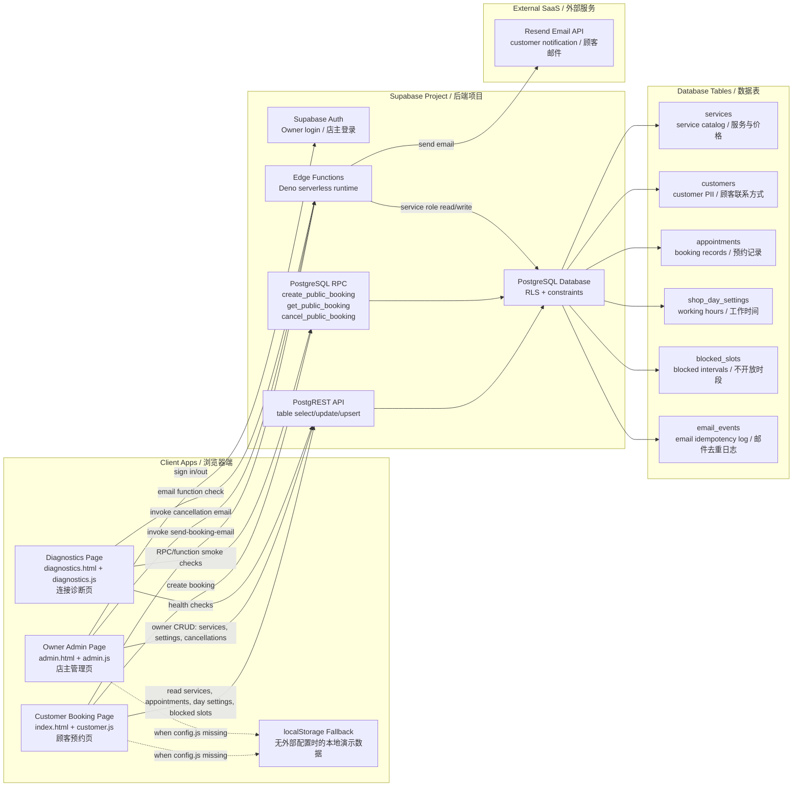
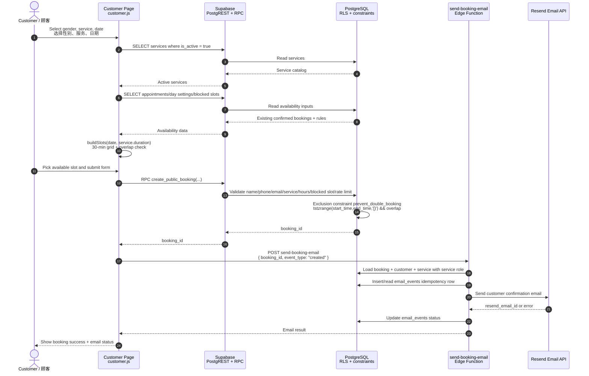
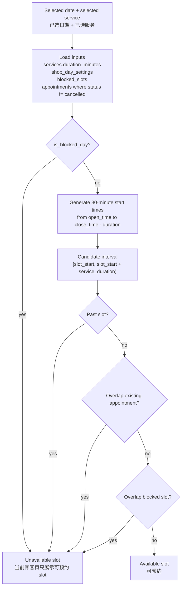
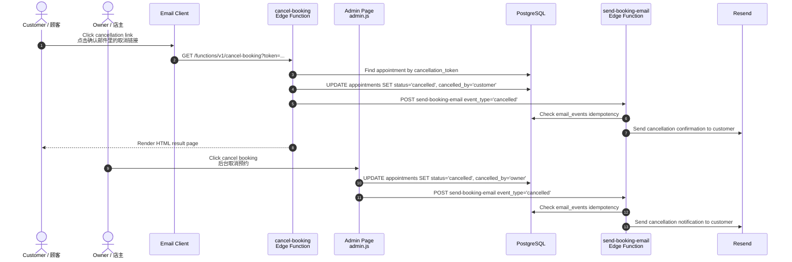
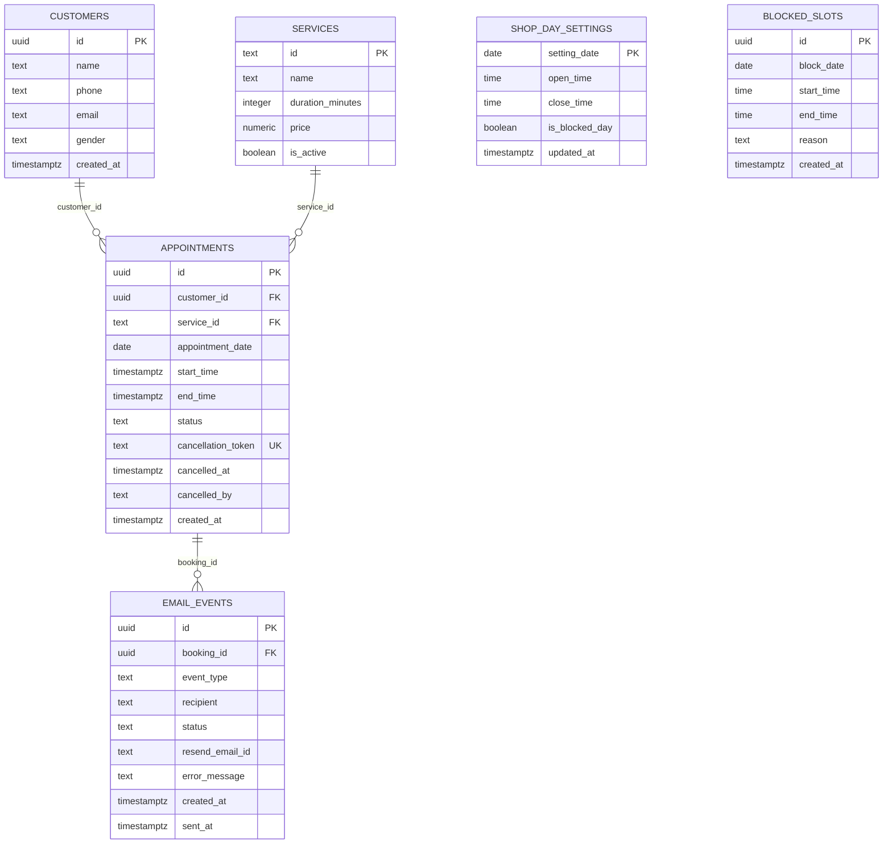
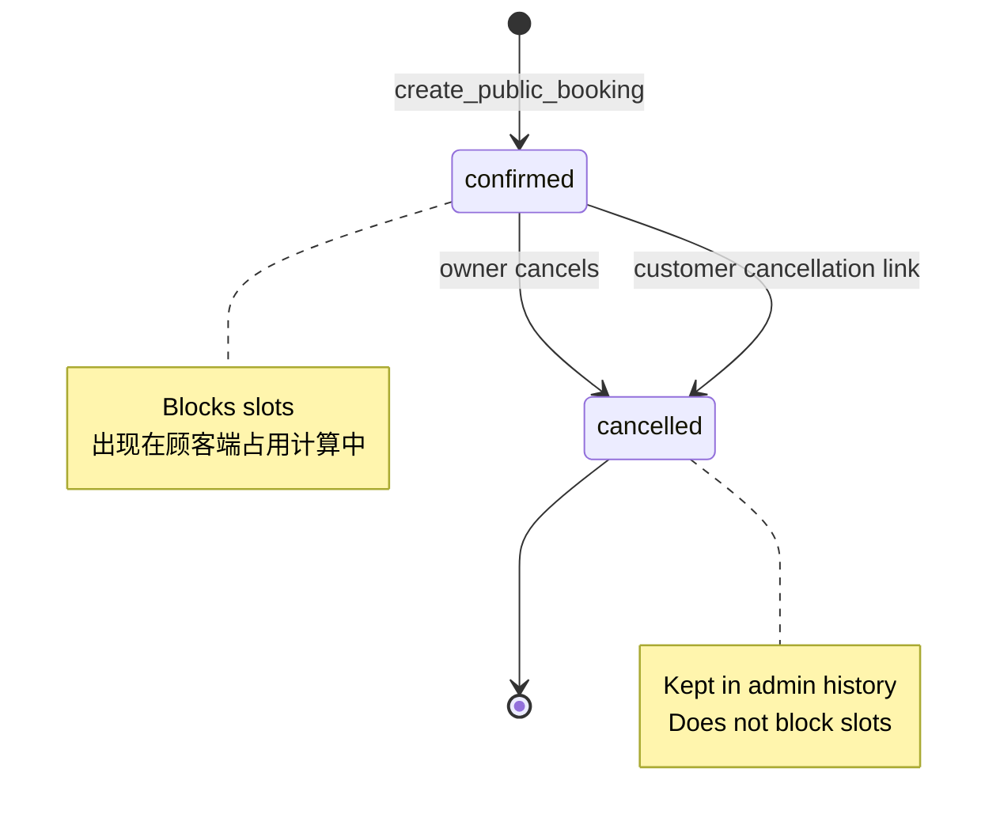
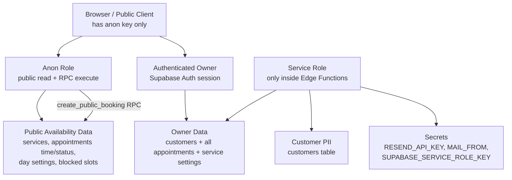
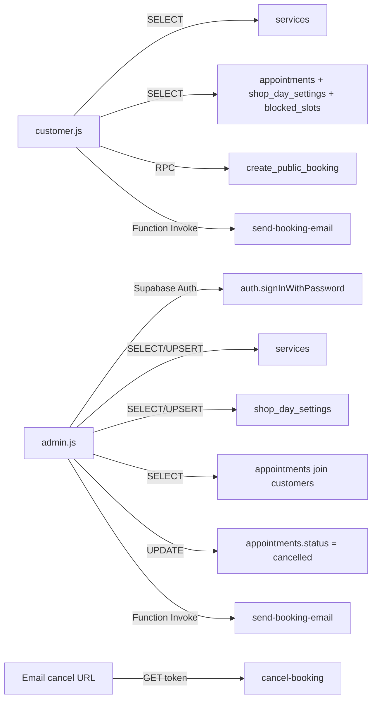
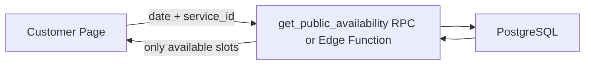

# OpenSlot Architecture / 架构示意图

这份文档描述当前已经跑通的 OpenSlot 理发店预约 MVP。术语以 English 为主，中文用于辅助理解。当前系统是一个 static web app + Supabase backend + Resend email 的轻量架构。

## 1. System Overview / 系统总览

### Key Idea / 核心思路

OpenSlot 的核心不是页面，而是 availability calculation（可用时间计算）和 double-booking prevention（防重复预约）。浏览器端负责交互和即时反馈，Supabase 端负责最终校验、并发冲突拦截、数据持久化和邮件触发。

## 2. Runtime Components / 运行组件

| Component | File / Service | Responsibility / 职责 |
| --- | --- | --- |
| Static Frontend | `index.html`, `customer.js`, `styles.css`, `i18n.js` | Customer booking UI, service/date/time selection, form validation, slot rendering |
| Owner Admin | `admin.html`, `admin.js` | Owner authentication, appointment list, cancelled bookings visibility, service/price/work-hour management |
| Diagnostics | `diagnostics.html`, `diagnostics.js` | Checks config, Supabase SDK, Auth, table access, RPC availability, Edge Function availability |
| Config Boundary | `config.js` from `config.example.js` | Holds public Supabase URL and anon key for browser runtime |
| PostgreSQL Schema | `supabase/setup.sql` | Tables, constraints, RLS policies, RPC functions |
| Booking RPC | `create_public_booking(...)` | Server-side booking validation and atomic insert |
| Email Function | `supabase/functions/send-booking-email/index.ts` | Reads booking with service role, sends customer emails through Resend, logs idempotency |
| Cancel Link Function | `supabase/functions/cancel-booking/index.ts` | Public GET endpoint for cancellation-token link in customer email |
| External Email | Resend | Real email delivery |

## 3. Booking Flow / 顾客预约流程

### Booking Validation Layers / 预约校验分层

| Layer | What It Checks | Why It Exists |
| --- | --- | --- |
| UI validation | Required fields, name length, selected slot, service/date selection | Fast feedback; avoids obvious bad input |
| Client availability check | Working hours, blocked day, blocked slot, existing non-cancelled appointments | Makes the slot grid responsive |
| RPC validation | Name/phone/email format, active service, 30-min increments, future date, working hours, blocked slots, simple rate limits | Browser data cannot be trusted |
| Database constraint | `prevent_double_booking` exclusion constraint on `tstzrange(start_time, end_time, '[)')` | Final concurrency guard; prevents race-condition double booking |

## 4. Slot Engine / Slot 计算

Current business rules（当前规则）：

- Slot granularity: `30 minutes`
- Default working hours: `10:00-19:00`
- Service duration comes from `services.duration_minutes`
- A slot is bookable only when the full service interval fits inside working hours
- Interval model is half-open: `[start, end)`, meaning an appointment ending at `11:00` does not conflict with another starting at `11:00`
- Cancelled appointments are kept for admin history but ignored for availability

## 5. Cancellation Flow / 取消预约流程

Cancellation design（取消设计）：

- `appointments.cancellation_token` is a random token generated by PostgreSQL using `gen_random_bytes(24)`.
- Customer email contains a one-click cancel URL pointing to `cancel-booking`.
- `cancel-booking` uses service role credentials inside Supabase Edge Function, not in the browser.
- Admin cancellation uses authenticated browser session and RLS policy.
- Cancelled bookings remain visible in admin but no longer block customer slots.

## 6. Database Model / 数据模型

### Important Constraints / 关键约束

| Constraint | Location | Purpose |
| --- | --- | --- |
| `prevent_double_booking` | `appointments` | Prevent overlapping non-cancelled appointment intervals |
| `appointments_cancellation_token_key` | `appointments.cancellation_token` | Ensure every public cancel link maps to one appointment |
| `unique (booking_id, event_type, recipient)` | `email_events` | Ensure one email event is sent only once per recipient |
| `duration_minutes % 30 = 0` policy check | `services` owner insert/update | Keep service durations aligned with slot grid |
| `close_time > open_time` | `shop_day_settings` | Prevent invalid working hours |
| `end_time > start_time` | `blocked_slots`, `appointments` | Prevent invalid time ranges |

## 7. Appointment State / 预约状态

The schema also allows `pending`, but the current MVP writes new bookings directly as `confirmed`. `pending` can be used later for online payment, manual approval, SMS verification, or deposit flows.

## 8. Security Boundary / 安全边界

Security rules currently implemented（当前已实现）：

- Browser only uses `SUPABASE_URL` and `anon public key`.
- Real customer insert happens through `create_public_booking(...)`, not direct table insert.
- `customers` table is not anonymously readable; owner login is required to view name/phone/email.
- `appointments` is publicly readable so the customer page can calculate occupied slots, but it does not expose customer details.
- Edge Functions use `SUPABASE_SERVICE_ROLE_KEY`, which must stay in Supabase secrets only.
- `send-booking-email` sends only customer emails and logs results into `email_events`.
- Basic abuse protection exists in `create_public_booking(...)`: max 3 bookings per same email or same phone within 10 minutes.

Security items still recommended for production（生产前建议补强）：

- Add CAPTCHA / Turnstile before public booking creation.
- Add stricter rate limiting by IP/device/session at an API gateway or Edge Function layer.
- Avoid exposing complete appointment timeline publicly if competitor abuse becomes serious; return only derived availability instead.
- Add owner role table instead of letting any authenticated Supabase user manage the shop.
- Add audit logs for admin changes and cancellations.
- Add backup/export strategy before real customer operation.

## 9. API Boundary / API 边界

The current frontend has a repository pattern（仓储模式）:

- `createSupabaseRepository(client)` talks to Supabase.
- `createLocalRepository()` talks to browser `localStorage`.
- UI code calls the repository interface, so the same UI can run without a backend for local demos.

## 10. Why These Technologies / 核心技术解释

### Static Web App

The frontend is plain HTML/CSS/JavaScript. There is no React/Vite build dependency in the current MVP runtime. This keeps deployment and debugging simple: any static server can host it.

中文理解：现在重点是跑通业务闭环，不是前端工程化。静态页面足够承载预约、后台、诊断三个入口。

### Supabase

Supabase provides PostgreSQL, Auth, PostgREST, RPC, Edge Functions, and secrets management in one platform.

中文理解：它不是单纯数据库，而是把数据库、登录、API、Serverless Function 组合成一个轻量 backend。

### PostgreSQL RPC

`create_public_booking(...)` is a `security definer` PostgreSQL function. The browser can call it, but the function itself runs database-side validation.

中文理解：顾客端不直接写 `customers` 和 `appointments`，而是把预约请求交给数据库函数处理。这样业务规则不会只留在前端。

### RLS

Row Level Security controls who can read or mutate rows.

中文理解：anon 用户可以读服务和时间占用，不能读客户联系方式；店主登录后才可以看客户信息和管理预约。

### Exclusion Constraint

The database uses `tstzrange(start_time, end_time, '[)') with &&` to prevent interval overlap for non-cancelled appointments.

中文理解：即使两个顾客几乎同时点击同一个时间，数据库也会拦住第二个重叠预约。这是比前端判断更可靠的最终防线。

### Edge Functions

Supabase Edge Functions run server-side TypeScript on Deno. They can safely use secrets like `RESEND_API_KEY` and `SUPABASE_SERVICE_ROLE_KEY`.

中文理解：发邮件和一键取消不能只靠浏览器做，因为浏览器不能保存私密 key。

### Resend

Resend is the external email provider. The app sends appointment confirmation and cancellation emails to customers only.

中文理解：店主已经有后台，所以当前逻辑不再给店主发邮件，减少噪音和免费额度消耗。

### Idempotency

`email_events` records `(booking_id, event_type, recipient)` and the delivery status.

中文理解：同一个预约、同一种邮件、同一个收件人只发一次，避免重复调用函数导致邮件重复发送。

## 11. Current Limitations / 当前限制

- Availability is still partly calculated in the browser; production can move this behind a dedicated availability API.
- Public appointment read exposes appointment dates and time ranges, although not customer PII.
- Abuse prevention is basic: email/phone rate limit exists, but no CAPTCHA, IP-based throttle, or deposit flow yet.
- Owner authorization is currently "any authenticated user"; production should restrict to explicit owner accounts.
- Email failure does not roll back booking or cancellation; it is logged in `email_events`.
- No online payment, SMS, WeChat mini-program, calendar sync, or multi-staff scheduling yet.

## 12. Suggested Next Architecture Step / 下一步架构建议

The next backend-oriented milestone should be an Availability API（可用时间 API）:

Why this matters（为什么重要）：

- The browser no longer needs to read all appointment time ranges.
- Competitors have less visibility into your actual booking density.
- Slot logic becomes centralized, testable, and easier to reuse in future mobile/WeChat clients.
- Later CAPTCHA, IP rate limit, and anti-abuse checks can be placed at the same boundary.
