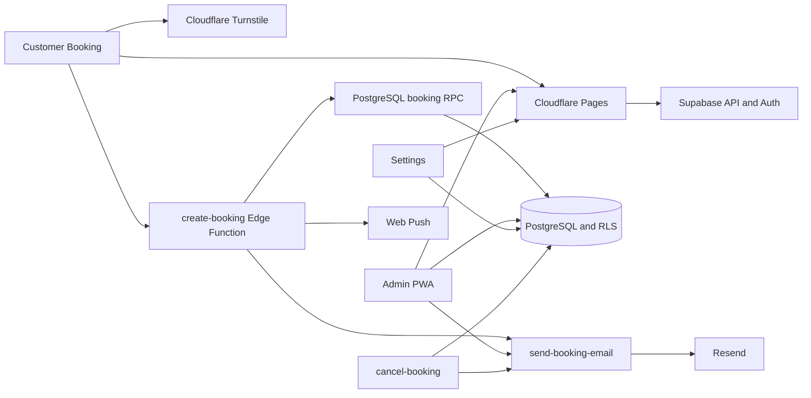
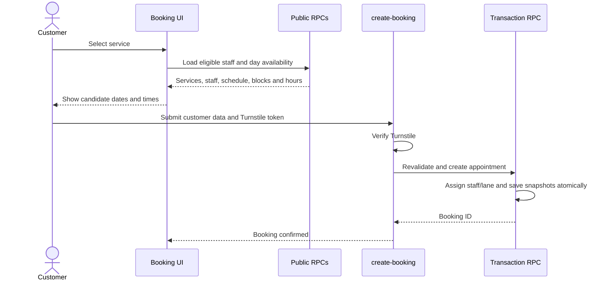

# OpenSlot Architecture

Updated: 2026-10-05

OpenSlot is a multi-tenant appointment platform built as a static web application with a Supabase backend. Booking, Admin, and Settings share production code; shop-specific behavior is selected by the URL slug and Supabase data.

## System Overview


```mermaid
flowchart LR
  Customer[Customer Booking] --> Pages[Cloudflare Pages]
  Admin[Admin PWA] --> Pages
  Settings[Settings] --> Pages
  Pages --> Supabase[Supabase API and Auth]
  Customer --> Turnstile[Cloudflare Turnstile]
  Customer --> Create[create-booking Edge Function]
  Create --> RPC[PostgreSQL booking RPC]
  RPC --> DB[(PostgreSQL and RLS)]
  Admin --> DB
  Settings --> DB
  Create --> Push[Web Push]
  Create --> Mail[send-booking-email]
  Admin --> Mail
  Mail --> Resend[Resend]
  Cancel[cancel-booking] --> DB
  Cancel --> Mail
```

### Responsibilities

| Layer | Responsibility |
| --- | --- |
| Cloudflare Pages | Static hosting, generated public configuration, asset versioning and redirects |
| Browser UI | Interaction, localization, previews and preliminary availability filtering |
| Supabase Auth | Admin, owner and staff sessions |
| PostgreSQL RPC | Final availability checks, authorization, locking and transactional writes |
| RLS | Cross-shop isolation and direct-access protection |
| Edge Functions | Turnstile verification, privileged email/cancellation work and push delivery |
| Resend | Transactional customer email delivery |

## Frontend Routes

```text
/{slug}/             Customer booking
/{slug}/admin/       Protected daily schedule and booking log
/{slug}/settings/    Account and shop settings
/template/           Local UI prototype; not deployed
```

Production routes use shared controllers:

- `customer.js`: public booking and availability UI.
- `admin.js`: authentication, daily schedule, blocks, manual appointments and booking log.
- `shared/settings-ui.js`: shared Settings UI.
- `shared/settings-repository.js`: Supabase Settings adapter.
- `shared/backoffice-i18n.js`: Admin and Settings localization.

The shop entry directories contain only route shells, media and PWA metadata. The current build still enumerates production shop directories in `scripts/build.js`; adding a new shop is therefore not yet a zero-code operation.

## Booking Model

### Service time

- `duration_minutes` defines the complete covered interval visible to the customer.
- `booked_slots` defines the 30-minute offsets during which the employee is actively occupied.
- Occupied offsets can be non-contiguous, allowing another appointment during processing or waiting time.
- A `service_snapshot` preserves the service facts used when an appointment was created.

### Staff and lanes

- Every active employee has two scheduling lanes by default.
- A booking can use one lane for its complete covered interval.
- The occupied offsets must not collide with occupied work across either lane of the same employee.
- If both lanes are covered at a candidate time, that time is unavailable even when an occupied offset appears free.
- Global and employee-specific day/time blocks are additional hard constraints.

### Availability flow


```mermaid
sequenceDiagram
  actor Customer
  participant UI as Booking UI
  participant Public as Public RPCs
  participant Edge as create-booking
  participant DB as Transaction RPC

  Customer->>UI: Select service
  UI->>Public: Load eligible staff and day availability
  Public-->>UI: Services, staff, schedule, blocks and hours
  UI-->>Customer: Show candidate dates and times
  Customer->>Edge: Submit customer data and Turnstile token
  Edge->>Edge: Verify Turnstile
  Edge->>DB: Revalidate and create appointment
  DB->>DB: Assign staff/lane and save snapshots atomically
  DB-->>Edge: Booking ID
  Edge-->>UI: Booking confirmed
```

The browser result is advisory. The transaction RPC is the final authority for concurrency and availability.

## Admin Model

- The schedule is a single-day timeline grouped by employee.
- Each employee column contains two internal lanes.
- Non-overlapping appointments span both lanes; covered-time overlaps render side by side.
- Portrait view shows up to two employees and landscape up to four; users may select fewer.
- Staff default to their own view and can modify only their own scope.
- Owner can modify the whole shop; platform administrator can access every shop.
- Online appointments are cancelled through Buchungslog. Manual appointments can be edited or deleted from their details.
- `get_admin_day_snapshot` consolidates day loading into one server request.

## Settings Model

The production Settings page uses Supabase, not `localStorage`.

- Account: role, email and password update.
- Employees: profile, short name, display color, active/online state and service assignments.
- Catalog: categories, services, translations, ordering, duration, occupied slots, prices and colors.
- Opening hours: weekly schedule.
- Shop: identity, contact details, back-office language and theme.

Staff can change their own password; other Settings content is read-only. Employees are created or removed only by the platform administrator in Supabase.

## Main Database Objects

| Area | Objects |
| --- | --- |
| Tenant and permissions | `salons`, `salon_members`, Supabase Auth |
| Employees | `salon_staff`, `staff_lanes`, `staff_services` |
| Catalog | `service_categories`, `services` |
| Scheduling | `appointments`, `schedule_entries`, `admin_time_blocks` |
| Customers | `customers` |
| Hours and closures | `salon_weekly_hours`, `shop_day_settings`, `public_holidays` |
| Communication | `email_events`, `push_subscriptions`, `booking_push_dispatches` |

`blocked_slots` and `staff_slot_overrides` are legacy compatibility objects and are not part of the current scheduling path.

## PWA and Cache Boundary

- Admin routes are installable PWAs.
- Navigations are network-first and use an offline information page only when the network fails.
- Appointment, customer, authentication and Settings responses are not cached.
- Offline writes are not queued.
- `/version.json` is checked periodically, on focus and after reconnecting.
- Push payloads are generic and contain no customer personal data.

## Template Boundary

`template/` is a local UI prototype backed by synthetic data and `localStorage`. The build verifies that it does not reference production Supabase or Turnstile resources and does not copy it to `dist/`. UI ideas may be ported from the template, but its repository must never be used as a production data source.

## Known Architecture Debt

1. Pending/failed email events are durable, but there is not yet an automatic background retry worker.
2. Owner cancellation still makes a second authenticated request to attempt immediate email delivery; the transactional outbox preserves the event if that request fails.
3. Production schema and migration history need a formal linked-environment reconciliation because several migrations were applied manually.
4. Core controllers are large and should be split into domain, repository and view modules.
5. There are no automated scheduling, RLS or end-to-end tests yet.
6. Build routing and PWA metadata still enumerate individual shops.
